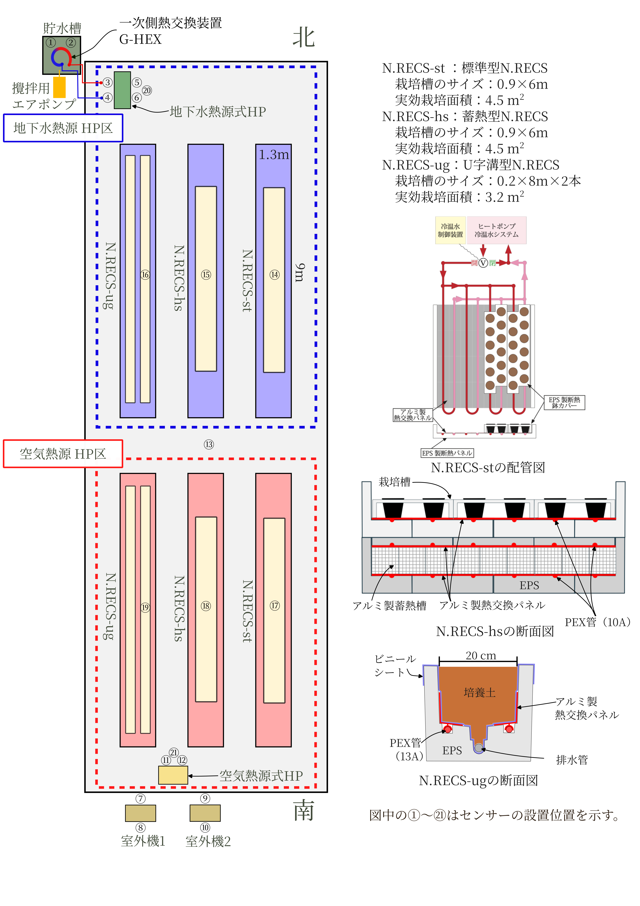

```{r}
#| include: false
#setup チャンク
library(gtExtras)
library(gt)
library(dplyr)
```

\newpage

# 目的

　CO~2~排出量の削減は世界規模の課題であり，我が国においても2050年までのカーボンニュートラルの達成が目標となっている。施設園芸では一般的に冬季には化石燃料由来のエネルギーによって，温室を暖房することが一般的に行われており，施設園芸における園芸作物生産はCO~2~の大幅な排出が伴うことから，この排出量の削減が大きな課題となっている。したがって，再生可能エネルギーおよび低利用エネルギーの積極的な利用を見据えた省エネルギー・低CO~2~排出栽培技術の開発が必要である。そこで，本研究ではアサノ大成基礎エンジニアリング株式会社が得意とする地中熱利用と日本大学が開発中の蓄熱型N.RECS（N.RECS-hs）を組み合わせて，省エネルギー・脱炭素型植物栽培システムを構築するとともに，従来方法と比較して本システムの性能を評価することを目的とする。
　すでに既往の研究では，夏季の高温によって生育が大きく抑制されるガーデンシクラメンを根域冷却すると生育が著しく促進されることが明らかとなっているが，従来の空気熱源式HP
　実験1では夏季のガーデンシクラメンの生育に及ぼす根域冷却
　を供試し，従来の空気熱源式HP
　地下水熱源式HPでは一次側の熱交換として，井戸からくみ上げた地下水を使用している。一次側の熱交換を行うには十分量の地下水を利用する必要があるが，地下水は大量にくみ上げると地盤沈下を招くなどの環境影響があることから，一部の地域では取水量に制限ある。したがって，地下水熱利用を普及させるには一次側熱交換における効率的な地下水の利用方法について検討する必要がある。そこで，実験1では異なる貯水槽水温と攪拌用空気ポンプの駆動が地下水熱源式HPの消費電力量とCOPに及ぼす影響について検討した。
　

# 材料および方法
## 温室内における装置の配置と運用

　日本大学生物資源科学部のフェンロー型プラスチック温室を東西に二分割し，東側を対照温室，西側を処理温室とした。 @fig-greenhouse に処理温室内におけるに熱源と各種N.RECS栽培装置の設置状況およびセンサーの設置位置を示した}。同温室内には幅1.3 m，長さ9 mの栽培ベンチが南北に3台ずつ，合計６台設置されている。北側と南側のベンチには，それぞれ標準型N.RECS（N.RECS-st），蓄熱型N.RECS-hs（N.RECS-hs），U字溝型N.RECS(N.RECS-ug）を導入した。
　N.RECS-stとN.RECS-hsの栽培槽の内寸は幅0.9 m，長さ6 mであるがPEX管のリターン部分を調整するためアルミ製熱交換パネルは5mの長さとしたため，実効栽培面積は4.5 m^2^であった。N.RECS-stにおける根域温度の制御はスマートガーデナー（オネスト）により行った。N.RECS-hsはN.RECS-stの栽培槽の下にN.RECS-stの実効栽培面積と同一面積の蓄熱槽を設置した。この蓄熱部分は外寸10 × 10 × 100 cmのアルミ製カートリッジ45本からなり，各カートリッジには8Lの水を充填した。このカートリッジの上下をアルミ製熱交換パネルで挟みPEX管に冷水を送液した。熱源から蓄熱槽および蓄熱槽から栽培槽への送液制御は，オネスト社製の制御装置により行った。N.RECS-ugは内寸0.2 m，長さ8 mのものを一つのベンチに2本設置した。根域温度の制御はN.RECS-stと同様にスマートガーデナーで行った。N.RECS用熱源は北側3ベンチを地下水熱式ヒートポンプ，南側3ベンチを空気熱源式ヒートポンプとした。熱源とN.RECSへの接続は並列とし，熱源からN.RECSまでの配管距離はほぼ同一であった。

{#fig-greenhouse fig-pos="H"}

## 供試した根域温度制御用のヒートポンプの種類と性能

　根域温度制御用のヒートポンプ（HP）には空気熱源式HP（Air
HP）としてエコヌクールレオ（三菱電機（株），VEH-712HCC-k），地下水熱源式HP（Water
HP）として（（株）長府製作所，GSHP-0624X）を用いた。Air
HPの一次側熱交換器（室外機）は温室南側の外に設置し，Water
HPの一次側熱交換は温室北西の外に設置した貯水槽内に未利用熱回収用熱交換ユニット（ジオシステム（株），G-HEX）に接続して行った。貯水槽には日本大学生物資源科学部の井戸水を供給し，供給のタイミングは貯水槽水温度が設定値を上回ったら井戸水を10
L／分の流速で注水した。井戸水の注水制御はスマートガーデナーで行った。
@tbl-spec に両熱源の主要諸元を示した。Air HPの冷却能力は7.2
kW，定格消費電力は2.57 kW，Water HPの冷却能力は6.0
kW，定格消費電力は1.33
kWであり，両熱源の計算上のCOPはそれぞれ2.80と4.51であった。

```{r}
#| label: tbl-spec
#| tbl-cap: "熱源の諸元"
#| tbl-pos: H
#| echo: false
#| message: false
#| warning: false

df <- read.table("/cloud/project/table/spec.csv",
                 sep=",",
                 comment.char="#",
                 header=T) 
gt(df) %>%
  cols_align(align = "center", columns = 3:6)  %>%
  tab_style(style = cell_text(align = "center"),
            locations = cells_column_labels()) %>%
  tab_spanner(column = 3:4, label="冷却（kW）") %>%
  tab_spanner(column = 5:6, label="加熱（kW）") %>%
  cols_label("cool_p"="能力","cool_ec"="定格消費電力","heat_p"="能力","heat_ec"="定格消費電力")
```

## 各部位の温度と流速測定に用いたセンサーと消費電力量の計算方法

　温度等のセンサーの設置位置は @fig-greenhouse の①〜㉑に示し，それらのセンサーの測定対象と種類等については @tbl-sensorID1 と @tbl-sensorID2 に示した。各種温度についてはサーミスタまたはPt100，両熱源の二次側流速は小型電磁流量センサー（愛知時計電機（株），VN10R）で計測した。全ての計測データは1分間隔でデータロガーに記録した。両熱源の消費電力量は小型電力モニタ（オムロン（株），KM-N1-FLK）で計測し，そのパルス出力をデータロガー（ティアンドデイ（株），RTR505B）で1分間ごとに記録した。
　記録したデータはRで作成したスクリプトにより適宜成形した後mysqlサーバーにアップロードし，異なるセンサーのデータを連結して適宜図を作成した。なお，Pt100の測定データの一部にノイズが見られたので，Rで作成したHampel関数によりノイズを除去した。

\clearpage
\blandscape

```{r}
#| label: tbl-sensorID1
#| tbl-cap: "センサーの設置場所，測定対象とセンサーの種類-1"
#| tbl-pos: H
#| echo: false
#| message: false
#| warning: false


sensor <- read.delim("/cloud/project/table/SensorID_1.tsv",
                 sep="\t",
                 comment.char="#",
                 header=T) 
gt(sensor)%>%
  cols_align(align = "center", columns = 1)%>%
  cols_align(align = "left", columns = 2:5)%>%
  fmt_markdown(columns = everything())             # 本文すべてのセルが対象
```

```{r}
#| label: tbl-sensorID2
#| tbl-cap: "センサーの設置場所，測定対象とセンサーの種類-2"
#| tbl-pos: H
#| echo: false
#| message: false
#| warning: false

sensor <- read.delim("/cloud/project/table/SensorID_2.tsv",
                 sep="\t",
                 comment.char="#",
                 header=T) 
gt(sensor)%>%
  cols_align(align = "center", columns = 1)%>%
  cols_align(align = "left", columns = 2:5)%>%
  fmt_markdown(columns = everything())             # 本文すべてのセルが対象
```

\elandscape
\clearpage

## 実験区の設定と装置の運用

　実験区は熱源としてAir HPとWater
HPの2種類に対して，N.RECSのシステムをN.RECS-st，N.RECS-hs，N.RECS-ugを組み組み合わせた6区と，根域温度制御を行わない対照区の合計7区を設けた\tabrefJP{tbl-exp_name}。

```{r}
#| label: tbl-exp_name
#| tbl-cap: "実験区の設定と熱源およびN.RECSの種類"
#| tbl-pos: H
#| echo: false
#| message: false
#| warning: false

exp_n <- read.delim("/cloud/project/table/name_exp.tsv",
                 sep="\t",
                 comment.char="#",
                 header=T) 
gt(exp_n)%>%
  cols_align(align = "center", columns = 1:3)%>%
  fmt_markdown(columns = everything())             # 本文すべてのセルが対象
```

　熱源の供給水温は10°Cとし，N.RECS-hsであるA-hs区とW-hs区の根域温度の設定値は21°C±0.5°C，その他の区は下限値を20°C，上限値を22°Cに設定した\tabrefJP{tbl-exp_setting}
。N.RECS-hs区とその他の区との根域温度の設定方法の違いは，制御装置が異なり設定値の指定方法が異なるためである。栽培植物にはN.RECS-ug区ではイチゴと切り花用ガーベラ，N.RECS-stとN.RECS-hsではガーデンシクラメンを供試した。なお，本実験における植物の栽培データについてはガーデンシクラメンについて報告する。

```{r}
#| label: tbl-exp_setting
#| tbl-cap: "各実験区における熱源の設定温度と栽培槽の制御温度"
#| tbl-pos: H
#| echo: false
#| message: false
#| warning: false

exp_set <- read.delim("/cloud/project/table/setting_exp.tsv",
                 sep="\t",
                 comment.char="#",
                 header=T) 
gt(exp_set)%>%
  cols_align(align = "center", columns = 1:2|5) %>%
    cols_align(align = "left", columns = 3:4) %>%
  tab_spanner(columns = 3:4,
              latex("根域温度の設定\\textsuperscript{z}"))%>%
  tab_source_note(
    source_note = latex("\\textsuperscript{z}\\setstretch{1} N.RECS-hsの制御装置では他の2区とは異なり，設定温度に対して±0.5°Cのヒステリシスで制御されている。上限値を超えると冷却が始まり，下限値に達すると冷却が停止する。")) %>%
  fmt_markdown(columns = everything())
```

## 成績係数（COP）の計算方法

　二次側の行き戻り水温差（ΔT）は，それぞれの測定値を1時間ごとに平均し，往き水温から戻り水温を差し引いて求めた。1時間当たりの冷却能力は（H）はΔTに1時間当たりの平均流量（Fr），ブラインの比重（Sw）と比熱（Sh）乗じて求めた。各熱源のCOPは冷却能力（H）を1時間当たりの消費電力量（EC）で除して求めた。なお，両熱源ともに夜間はCOPの変動が大きかったため，両者の比較を容易にするために6:00〜18:00のデータを示した。

$$
\begin{aligned}
COP &= \frac{H}{EC}\\
H &= \Delta T \cdot Fr \cdot Sg \cdot Sh
\end{aligned}
$$
$$
\begin{aligned}
COP &= \text{成績係数}\\
H（kW） &= \text{1時間当たりの冷却能力}\\
EC（kW） &= \text{1時間当たりの消費電力量}\\
ΔT（K） &= \text{往き側と戻り側の一時間当たりの平均水温（°C）の差}\\
Fr（L） &= \text{二次側ポンプの平均流速（L／min）×60分}\\
Sg &= \text{ブラインの比重（1.04）}\\
Sh（kJ／kg） &= \text{ブラインの比熱（3.78）}
\end{aligned}
$$
ブラインの比重と比熱はプロピレングリコール濃度が37 wt％，水温10°Cの時のデータである。プロピレングリコールの比熱と比重は，三菱電機空冷式ブラインクーラBFL−SP○○○E形取扱説明書（2011年1月作成）p28，図9-8　プロピレングリコール水溶液の比熱（0.9 cal/g）および図9-9から引用した。

## 実験1 Water HPの貯水槽水温の制御と水攪拌用エアポンプの作動の有無がCOPに与える影響
　Water HPでは一次側の熱交換として井戸からくみ上げた地下水を使用している。一次側の熱交換を行うには十分量の地下水を利用する必要があるが，地下水は大量にくみ上げると地盤沈下を招くなどの環境影響があることから，一部の地域では取水量に制限ある。したがって，地下水熱利用を普及させるには一次側熱交換における，効率的な地下水の利用方法について検討する必要がある。そこで，本実験では異なる貯水槽水温と攪拌用空気ポンプの駆動がWater HPの消費電力量とCOPに及ぼす影響について検討した。
　
　@tbl-well_setting に貯水槽に井戸水を注水する際の，貯水槽水温の注水開始と注水停止温度と空気ポンプの作動状況を示す。本実験は2025年8月16日から9月4日にかけて実施し，期間中にそれぞれの設定で2〜3日間連続して運用し，そのときの貯水槽水温，供給した井戸水の水温，期間中の消費電力量，COPを取り纏めた。
```{r}
#| label: tbl-well_setting
#| tbl-cap: "貯水槽への井戸水の注水開始・停止温度と空気ポンプの作動状況"
#| tbl-pos: H
#| echo: false
#| message: false
#| warning: false

well_set <- read.delim("/cloud/project/table/well_settings.tsv",
                 sep="\t",
                 comment.char="#",
                 header=T) 
gt(well_set)%>%
  cols_label(
    `開始温度` = latex("開始温度（$^\\circ$C）")) %>%
  cols_label(
    `停止温度` = latex("停止温度（$^\\circ$C）")) %>%
  cols_align(align = "left", columns = 1) %>%
  cols_align(align = "center", columns = 2:4) %>%
  tab_spanner(columns = 2:3,
              latex("井戸水の注水"))%>%
  fmt_markdown(columns = everything())
```

## 実験2　根域冷却がガーデンシクラメンの生育に及ぼす影響
　供試植物はガーデンシクラメン（$Cyramen$ $persicum$ L.）‘ベラノミックス’のセル成形苗を未来アグリスから購入し，2025年7月？日に3.5号鉢に鉢上げした。栽培用培地にはモノタロウから購入した培養土（53854938）と赤玉土（小粒）を等量混合したものを用い，鉢上げと同時に肥料としてマグァンプK（N-P~2=O~5~-K~2~O-MgO=6-40-6-15，（株）ハイポネックスジャパン）を一鉢当たり3gを施用した。
　
　
　
実験は2025年


## 実験2

# 結果

## 実験期間中の温室内の気温の推移

## 考察
